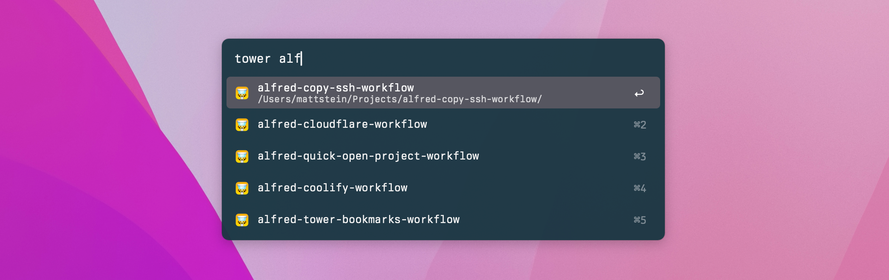

# Tower Alfred Workflow

Jump to specific [Tower](https://www.git-tower.com/mac) bookmarks directly from [Alfred](https://www.alfredapp.com).

This PHP version of the workflow is adapted from [cjlucas/tower-alfred-workflow](https://github.com/cjlucas/tower-alfred-workflow), which stopped working for me at some point.

Screenshot using the dark variant of my [custom theme](https://github.com/mattstein/alfred-theme).

## Installation

Download the `.alfredworkflow` file from the [latest release](https://github.com/mattstein/alfred-tower-bookmarks-workflow/releases) and double-click to install.

## Usage

Use the Alfred trigger `tower` to automatically list all repository bookmarks. Add an argument to narrow the list, like `tower alf`.

Press <kbd>return</kbd> to launch Tower with the selected bookmark.
